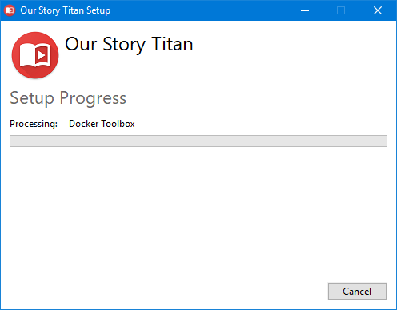
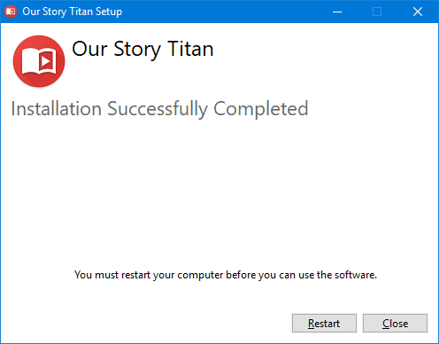
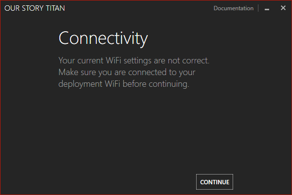
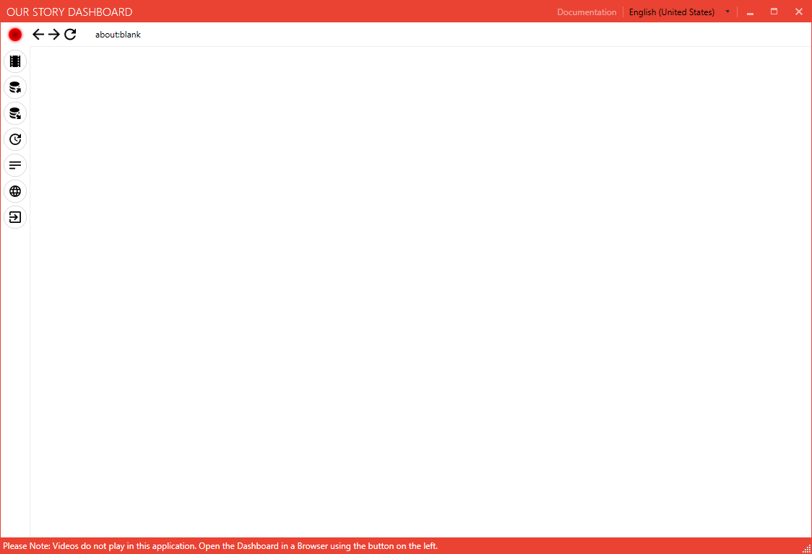

# Our Story Titan Installer

Our Story depends on a technology called Virtualisation on Windows. If you are unsure whether your computer supports the never version (Called HyperV), download the `Toolbox` installer.

> Most computers with Windows 10 Pro, Education or Enterprise will have this support enabled.

## Download Files

Download the following files in this directory onto your machine or USB stick:

> Tip: `Right Click` and then `Save Link As` to download the following files:

- [images.tar](https://s3-eu-west-1.amazonaws.com/bootleggerlive/titan/images.tar)
- [For Windows 7, 8.1, 10 Home (Toolbox)](https://github.com/our-story-media/ourstory-titan/releases/download/v0.1-beta/OurStoryToolbox.exe) or [For Windows 10 Pro (HyperV)](https://github.com/our-story-media/ourstory-titan/releases/download/v0.1-beta/OurStoryHyperV.exe)

----

## Installation Guide

Once downloaded, you should not require internet connectivity, if you have both the above files.

> At some points during this installation you may be asked to input your Administration credentials for the Local Machine. Please do not skip any of these steps, as they are vital parts of the installation.

When opening the installer, please read the introduction text and agree. Then click Install.

Depending on your system, Our Story will run additional installations which may pop up their own dialogs. Please do not close any of these.

Once the installer is complete, reboot your computer by pressing the button, or save your work and manually reboot.

> Do not try starting Our Story without rebooting your computer. This will lead to possible complications.

Start the Our Story application from the Desktop using the icon provided. Select the `LOCATE IMAGES.TAR FILE` button...

 and select the downloaded file.

As this is the first time running Our Story, it will take a bit of time to setup all the components. Please wait and do not close or turn off your computer while this process is happening. On some computers this may take up to 15 minutes.

Once this initial step has completed, you are presented with a check. At this point you need to connect your computer to the Our Story WiFi network you have prepared, with an IP range of `10.10.10.*`. Our Story will attempt to autoconfigure your computer to match these settings.

> You can continue without an Our Story router, however some images and functions may not work as expected.

The Our Story application will then start. When the light in the top left goes green, the `Dashboard` will appear in the window. You can then configured your shoots.

Buttons down the side of the window provide extra functionality such as backup and opening the folder where the videos are located.

